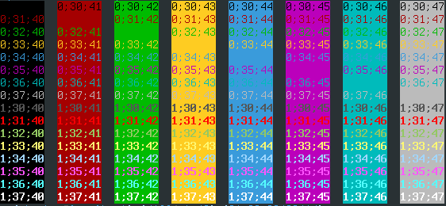

Obsidian-rxvt-unicode
=====================

Obsidian color scheme for rxvt-unicode

Installation
------------
Copy contents from "dot-Xdefaults" file to your own ".Xdefaults".
Or just copy the file under tour home directory and rename it to ".Xdefaults".
